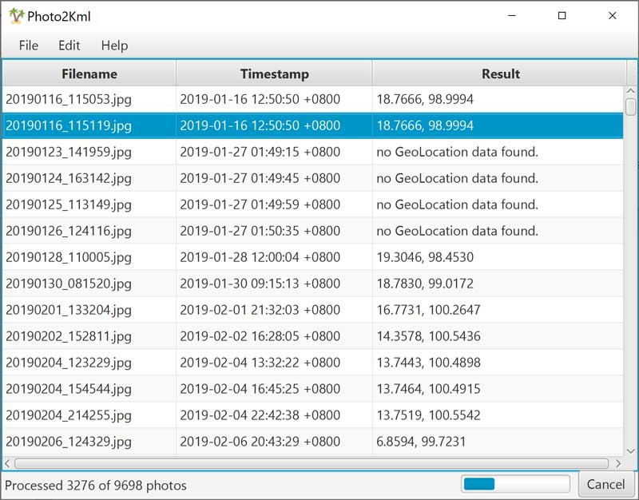

# Photo2Kml
A desktop application to quickly search for photo files in a directory and collect all GPS coordinates that the camera may have included in the file. The GPS coordinates can then be saved to a KML file that can then be used with many other applications like Google Earth. 

## Download and Install
 1. Ensure Java 8 or later is installed.
    * [How to check your version](https://www.java.com/en/download/help/version_manual.xml)
    * [Download Java](https://www.java.com/en/download/)
 2. Download the Photo2Kml zip file that is appropriate for your system.
    * [Download photo2kml-1.0-win.zip for Windows](https://github.com/will-quast/photo2kml/releases/latest)
    * [Download photo2kml-1.0-mac.zip for Mac](https://github.com/will-quast/photo2kml/releases/latest)
    * [Download photo2kml-1.0-bin.zip for Linux or command line](https://github.com/will-quast/photo2kml/releases/latest)
 3. Unzip all files to a convenient directory.
 4. Run the application with the provided launcher.
    * On Windows run `photo2kml.exe`  Note: The exe and lib directory must remain together.
    * On Mac run `photo2kml.app`
    * On Linux run `bin/photo2kml`

## About
Photo2Kml is created by William Quast.
It is free to download and use. The source code is available here under an Apache 2.0 license.
The library [metadata-extractor](https://github.com/drewnoakes/metadata-extractor) by [Drew Noakes](https://drewnoakes.com/code/exif/) is used to read photo Exif data.

   Google Earth™ is a trademark of Google Incorporated.  
   Java™ is a trademark of Oracle Incorporated.  

